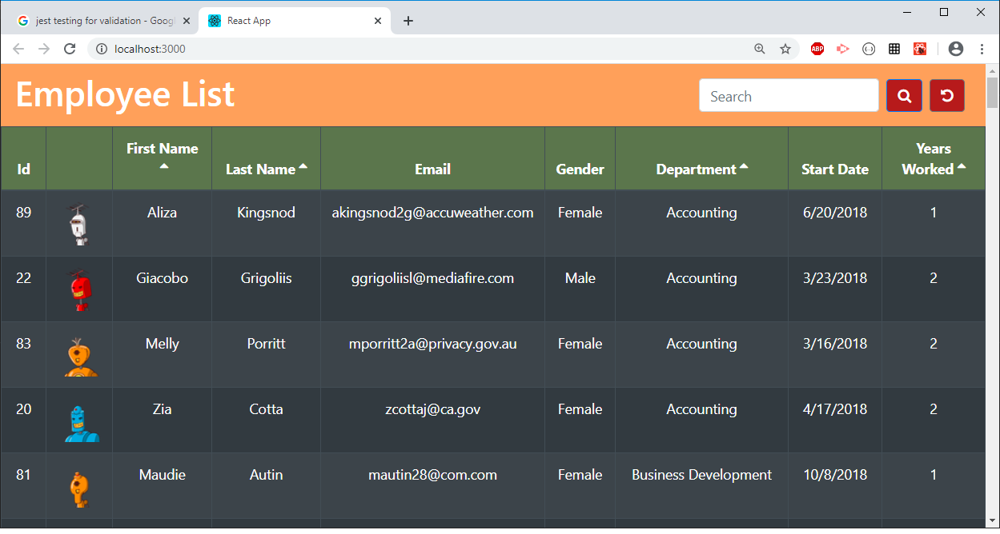
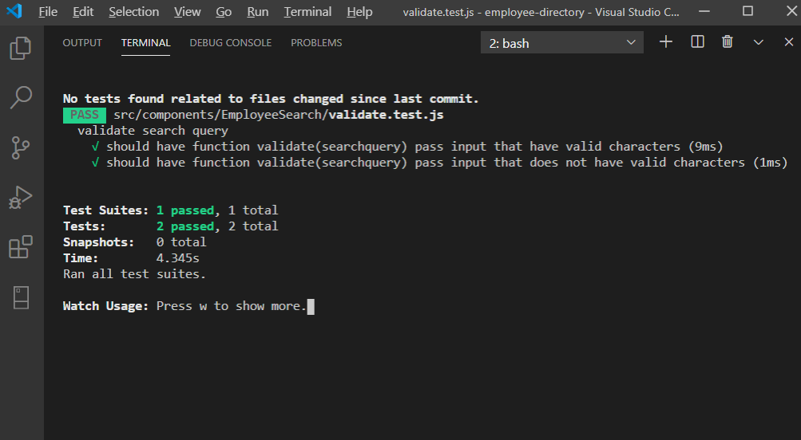

# Employee Directory(React)

  
## Table of contents:
-   [ Description ](#description)
-   [ Installation ](#installation)
-   [ Deployed Link ](#deploy)
-   [ Usage ](#usage)
-   [ Test ](#test)
-   [ License ](#license)
## <a name="description"></a>Description:

'Employee-directory' app enables one to view non-sensitive data about other employees. It would be particularly helpful to be able to filter employees by name and sort employees by first name, last name, department or numbers of years an employee has worked. Powered by React.

## <a name="installation"></a>Installation:

```bash
    npm i
```

## <a name="deploy"></a>Deployed Link:

https://graphicaction.github.io/employee-directory/

## <a name="usage"></a>Usage:
```bash
    npm start 
```


## <a name="test"></a>Test:

```bash
    npm run test
```


## <a name="contributing"></a>Contributing:
Pull requests are welcome. For major changes, please open an issue first to discuss what you would like to change.Code of Conduct: Standard (Fork, Clone, Commit, Push and Create Pull requests).

## <a name="license"></a>License:
 <i>MIT Copyright (c). All rights reserved.</i>


